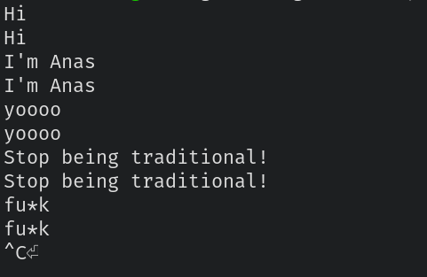

<p align="center"> 


</p>

# brainfuc*k interpreter: a simple brainfuc*k interpreter and REPL writen in rust 🦀

## Install

- from crates.io
    ```shell
    cargo install bf-interpreter
    ```
- From aur: 
  ```shell
  yay -S bf-interpreter
  ```

## Options and arguments

```shell
bf-interpreter --help
```
```text
Brainfu*k interpreter and REPL written in Rust

Usage: bf-interpreter [OPTIONS] [SOURCE]

Arguments:
  [SOURCE]
          The brainfuck source code file to run (if not will be entered in REPL mode)

Options:
  -f, --features <FEATURES>
          Possible values:
          - reverse-counter:
            If the value is you want decrement the value and the value is 0, set the value to 255, otherwise decrement the value. If the value is you want increment the value and the value is 255, set the value to 0, otherwise increment the value
          - reverse-pointer:
            If the pointer at the end of the array, set the pointer to 0, otherwise increment the pointer. If the pointer at the beginning of the array, set the pointer to the end of the array, otherwise decrement the pointer

  -a, --array-size <ARRAY_SIZE>
          The brainfuck array size
          
          [default: 30000]

  -w, --without-tiles
          Dont print the tiles (e.g. exit code, file name, etc)

  -h, --help
          Print help information (use `-h` for a summary)

  -V, --version
          Print version information
```

### Examples

```bash
bf-interpreter test_code/hello_world.bf
```
```text
Hello world!
Successfully ran brainfuck source code from file: test_code/hello_world.bf
Exiting with code: 0
```

```bash
bf-interpreter -w test_code/hello_world.bf
```
```text
Hello world!
```

```bash
bf-interpreter test_code/print_hi_yooo.bf
```
```text
Hi yoooooooooooooooooooooooooooooooooooooooooooooooooooooooooooooo!Successfully ran brainfuck source code from file: test_code/print_hi_yooo.bf
Exiting with code: 0
```

```bash
bf-interpreter -w test_code/print_hi_yooo.bf
```
```text
Hi yoooooooooooooooooooooooooooooooooooooooooooooooooooooooooooooo!
```

```bash
bf-interpreter test_code/like_cat.bf
```

