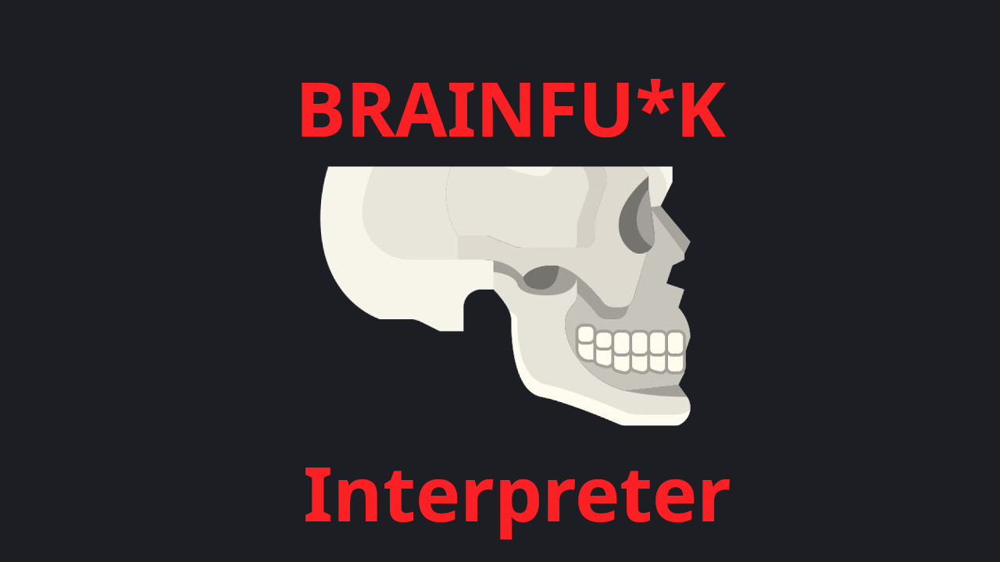

<p align="center"> 



</p>

# brainfuc*k interpreter: a simple brainfuc*k interpreter and REPL writen in rust 🦀
#### *Read this in other languages.*

[AR Arabic-العربية](README-ar.md)

## Features
- Run brainfuc*k code from a file 💫
- Run brainfuc*k live code from the REPL 🚀
- Support utf-8 characters including emojis 😍 (optional)
- You can control in the array size 📏

## Install

- from crates.io
    ```shell
    cargo install bfy
    ```
- From aur: 
  ```shell
  yay -S bfy
  ```

## Options and arguments
<details>
   <summary>Options table</summary>
   <table>
      <thead>
         <tr>
            <th>Option</th>
            <th>Description</th>
            <th>Default</th>
         </tr>
      </thead>
      <tbody>
         <tr>
            <td><code>-h</code>, <code>--help</code></td>
            <td>Prints help information</td>
            <td></td>
         </tr>
         <tr>
            <td><code>-V</code>, <code>--version</code></td>
            <td>Prints version information</td>
            <td></td>
         </tr>
         <tr>
            <td><code>-f</code>, <code>--features</code></td>
            <td>
               The extra features to enable<br/>
               Possible values:
               <ul>
                  <li>no-reverse-value:<br/>
                     If the value is you want decrement the value and the value is 0, don't set the value to 255, otherwise decrement the value.<br/>
                     If the value is you want increment the value and the value is 255, don't set the value to 0, otherwise increment the value. The alias are:
                     `nrv`
                  </li>
                  <li>reverse-pointer:<br/>
                     If the pointer at the end of the array, set the pointer to 0, otherwise increment the pointer.<br/>
                     If the pointer at the beginning of the array, set the pointer to the end of the array, otherwise decrement the pointer. The alias are: `rp`
                  </li>
                  <li>allow-utf8:<br/>
                     Allow the use of utf8 characters (32 bit), otherwise only 8 bit characters are allowed.<br/>
                     Use this feature with caution because it increases the cell size from 8 bits to 32 bits.<br/>
                     It also allow you to use the emoji in your brainfuck code :D, This is if you can
                     preserve your mind so that you can access their digital value :).<br/>
                     The `u32` in rust can only store values from 0 to 4294967295, but we
                     can only use 0 to 1114111 (0x10FFFF) for now. The alias are: `utf8`
                  </li>
               </ul>
            </td>
            <td>n/a</td>
         </tr>
         <tr>
            <td><code>-a</code>, <code>--array-size</code></td>
            <td>The size of the array</td>
            <td>30000</td>
         </tr>
         <tr>
            <td><code>-w</code>, <code>--without-tiles</code></td>
            <td>Dont print the tiles (e.g. exit code, file name, etc)</td>
            <td></td>
         </tr>
      </tbody>
   </table>
</details>


<details>
<summary>Help option output</summary>

```shell
bfy --help
```
```text
Brainfu*k interpreter and REPL written in Rust

Usage: bfy [OPTIONS] [SOURCE]

Arguments:
  [SOURCE]
          The brainfuck source code file to run (if not will be entered in REPL mode)

Options:
  -f, --features <FEATURES>
          Possible values:
          - no-reverse-value:
            If the value is you want decrement the value and the value is 0, don't set the value to 255, otherwise decrement the value. If the
            value is you want increment the value and the value is 255, don't set the value to 0, otherwise increment the value. The alias are:
            `nrv`
          - reverse-pointer:
            If the pointer at the end of the array, set the pointer to 0, otherwise increment the pointer. If the pointer at the beginning of the
            array, set the pointer to the end of the array, otherwise decrement the pointer. The alias are: `rp`
          - allow-utf8:
            Allow the use of utf8 characters (32 bit), otherwise only 8 bit characters are allowed. Use this feature with caution because it
            increases the cell size from 8 bits to 32 bits. It also allow you to use the emoji in your brainfuck code :D, This is if you can
            preserve your mind so that you can access their digital value :). The `u32` in rust can only store values from 0 to 4294967295, but we
            can only use 0 to 1114111 (0x10FFFF) for now. The alias are: `utf8`

  -a, --array-size <ARRAY_SIZE>
          The brainfuck array size
          
          [default: 30000]

  -w, --without-tiles
          Dont print the tiles (e.g. exit code, file name, etc)

  -h, --help
          Print help information (use `-h` for a summary)

  -V, --version
          Print version information
```

</details>

### Examples

```bash
bfy test_code/hello_world.bf
```
```text
Hello world!
Successfully ran brainfuck source code from file: test_code/hello_world.bf
Exiting with code: 0
```

```bash
bfy -w test_code/hello_world.bf
```
```text
Hello world!
```

```bash
bfy test_code/print_hi_yooo.bf
```
```text
Hi yoooooooooooooooooooooooooooooooooooooooooooooooooooooooooooooo!Successfully ran brainfuck source code from file: test_code/print_hi_yooo.bf
Exiting with code: 0
```

```bash
bfy -w test_code/print_hi_yooo.bf
```
```text
Hi yoooooooooooooooooooooooooooooooooooooooooooooooooooooooooooooo!
```

```bash
bfy test_code/like_cat.bf
```

> Note: The output is not the same as the current version of the interpreter, but it is the same as the output of the interpreter when I wrote the code.

## REPL
```bash
bfy # REPL mode
```


## TODO
- [ ] Add more tests
- [ ] Add more examples
- [ ] Create the brainfuck formatter
- [ ] Add syntax highlighting in the REPL
- [ ] Add auto completion in the REPL
- [ ] Support dynamic array size feature

## Resources
- [Brainfuck in wikipedia](https://en.wikipedia.org/wiki/Brainfuck)
- [Programming in Brainfuck](http://cydathria.com/bf/brainfuck.html)
- [Brainfuck: An Eight-Instruction Turing-Complete Programming Language](http://www.muppetlabs.com/~breadbox/bf)
- [brainfuck-visualizer](https://github.com/usaikiran/brainfuck-visualizer)
- [Basics of BrainFuck](https://gist.github.com/roachhd/dce54bec8ba55fb17d3a)
- [An elegant programming language: Brainfuck](https://www.neperos.com/article/raqehg6b24ceadba)
